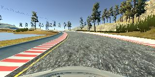
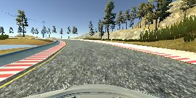
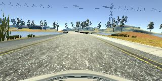

# Behaviorial Cloning Project

Overview
---
In this project a simulator has been provided where one can steer a car around a track for data collection and then use image data and steering angles to train a neural network and then use this model to drive the car autonomously around the track.

Pipeline
---
*The pipeline along with the corresponding python codes will be described here.*
Note: I have not included the training data in my submission, because my github repository has limited space.*

 

I. The first step was driving the car around the track and recording video files. The most challenging part of this project for me was gathering data. Because I tried different cases and finally one of them worded out. I name three cases, the first two failed to guid the car in the autonomous mode but the last one was able to help the car go around the track autonomously.
* Driving two times around the track smoothly and save the data. After than I ran it through the model and test the model on the first track in autonomous mode. The car almost made it to be successful but on one of the curves, the car slightly went over the curb. It should be mentioned that the car came back to the road and continued successfully afterwards. 
* Two rounds of driving smoothly and 1 round of falling off from the center and bringing the car back to the center. This approach was even worst and the car was not able to drive successfully in autonomous mode.
* After doing the first two cases, I decided to focuse more on the curves and trying to drive very badly around the curves and bringing the car back to the road so that there will be lots of these. I did this for 2 and a half times around the track. At the end I drove once around the curve smoothly. One thing that I noticed is that in order for the car to drive successfully around the track in autonomous mode, it should know how to stay away from the lines on the edge of the road. This way even if the car does not drive smoothly, it can at least survive around the sharp curves to the center of the road. At the end in order to make the driving experience more smooth in the autonomous mode, I drove once very smoothly around the track. I didn't drive smoothly around the track more than once because whenever I did more than once the car would forget about the curves and edges of the road and reacts slowly to sharp turns.

 The following shows driving next to the edge of the curve and bringing the car back to the center of the road 

	

 Here is an example of driving at the center of the road smoothly.  

 

 

II. Data Preprocessing: 
* Raw pixel values have lots of variations from 0 to 255, in order to make the model less sensitive to these variation we normalized each pixel value by dividing it by 255 and subtracting it from 0.5 so that all values would be in the range of 
-0.5 to +0.5. Line 68 in model.py
* Left and right camera images as well as center camera images are added to the training set. The steering angle that we collected during the training phase is just for the center camera, in order to make it also work for the left and right camera we add and subtract some constant(0.2) from it. Also, in order to make the model robust to both right turn and left turn, we augment the data by adding the flip of each image to the training set and also multiply its corresponding steering wheel angle by -1. Lines 45-58 in model.py

 

 

III. The architecture that was chosen is based on <a href = "https://arxiv.org/pdf/1604.07316.pdf">this</a> article by NVIDIA's self driving car group. The overall model block diagram is shown in the following figure.
* hello
* yeah

	

 

Some more details about the implementation:
* The architecture is exactly the same as the above figure except dropout out layers that were being used after the first and second fully connected layers. 
* The architecure worked pretty well and I have not spend that much time figuring it out.
* Since the testing environment was the same as the training one, number of epoch was chosen .
* Lines 67-85 in model.py are for the model implementation in Keras.
 
 
  

